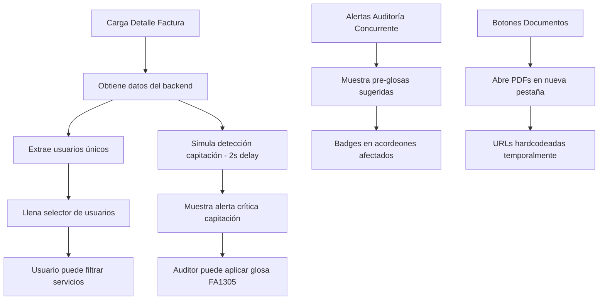

# 📋 NEURAUDIT - DOCUMENTACIÓN DETALLE FACTURA COMPLETO

## 📅 Fecha: 31 Julio 2025
## 👨‍💻 Desarrollador: Analítica Neuronal
## 🏥 Cliente: EPS Familiar de Colombia

---

## 🎯 OBJETIVO

Documentar la implementación completa de la vista de Detalle de Factura del módulo de auditoría médica, incluyendo todas las funcionalidades avanzadas implementadas para mejorar el proceso de auditoría.

---

## ✅ FUNCIONALIDADES IMPLEMENTADAS

### 1. **Acordeones para Todas las Secciones**
- ✅ 8 tipos de servicios en acordeones (Consultas, Procedimientos, Medicamentos, Otros Servicios, Urgencias, Hospitalización, Recién Nacidos, **Ayudas Diagnósticas**)
- ✅ Alertas de Auditoría Concurrente en acordeón
- ✅ Alertas de Usuarios en Capitación en acordeón
- ✅ Todos inician colapsados por defecto
- ✅ Badges con conteos y valores

### 2. **Selector de Usuarios Multi-usuario**
- ✅ Dropdown para filtrar servicios por usuario
- ✅ Extracción automática de usuarios únicos desde datos RIPS
- ✅ Formato: Tipo Doc + Número + Nombre
- ✅ Filtrado reactivo de todos los servicios

### 3. **Visualización de Documentos PDF**
- ✅ Botones en footer del header de factura
- ✅ Acceso directo a Factura PDF y RIPS
- ✅ Dropdown con soportes adicionales
- ✅ Simulación hardcodeada con URLs de ejemplo
- ✅ Preparado para integración con Digital Ocean Spaces

### 4. **Alertas de Auditoría Concurrente**
- ✅ Pre-glosas sugeridas para servicios hospitalarios
- ✅ 5 alertas simuladas (2 procedimientos, 2 hospitalización, 1 urgencias)
- ✅ Badges de alerta en headers de acordeones afectados
- ✅ Códigos oficiales de glosa según Resolución 2284

### 5. **Detección de Usuarios en Capitación**
- ✅ Alerta crítica para posible doble cobro
- ✅ Simulación de 2 usuarios detectados en contratos de capitación
- ✅ Tabla detallada con servicios afectados y valores
- ✅ Aplicación de glosa FA1305 individual o masiva
- ✅ Total en riesgo: $3,250,000

### 6. **Mejoras Adicionales**
- ✅ Número de contrato visible en header
- ✅ Nueva sección AYUDAS DIAGNÓSTICAS con icono microscopio
- ✅ Separación visual entre acordeones y resumen de auditoría
- ✅ Logs de debug para desarrollo

---

## 📁 ARCHIVO PRINCIPAL

```
/frontend-vue3/src/views/auditoria/DetalleFactura.vue
```

---

## 🏗️ ESTRUCTURA DE COMPONENTES

### **1. Header de Factura con Documentos:**
```vue
<div class="card custom-card">
  <div class="card-header">
    <!-- Información de factura -->
  </div>
  <div class="card-footer bg-light">
    <div class="btn-group" role="group">
      <button @click="verDocumento('FACTURA')" class="btn btn-sm btn-primary">
        <i class="ri-file-pdf-line me-1"></i> Ver Factura PDF
      </button>
      <button @click="verDocumento('RIPS')" class="btn btn-sm btn-info">
        <i class="ri-file-code-line me-1"></i> Ver RIPS
      </button>
      <!-- Dropdown otros soportes -->
    </div>
  </div>
</div>
```

### **2. Alertas en Acordeón:**
```vue
<!-- Auditoría Concurrente -->
<div class="accordion" id="alertasAccordion">
  <div class="accordion-item border-warning">
    <h2 class="accordion-header">
      <button class="accordion-button collapsed bg-warning-transparent">
        <i class="ri-alert-line me-2"></i>
        <span class="fw-semibold">Alertas de Auditoría Concurrente</span>
        <span class="badge bg-warning ms-2">5 Alertas</span>
      </button>
    </h2>
    <div id="collapseAlertasConcurrentes" class="accordion-collapse collapse">
      <!-- Contenido alertas -->
    </div>
  </div>
</div>

<!-- Usuarios en Capitación -->
<div class="accordion" id="alertasCapitacionAccordion">
  <div class="accordion-item border-danger">
    <h2 class="accordion-header">
      <button class="accordion-button collapsed bg-danger-transparent text-danger">
        <i class="ri-error-warning-line me-2"></i>
        <span class="fw-semibold">ALERTA CRÍTICA - Usuarios en Modalidad Capitación</span>
        <span class="badge bg-danger ms-2">2 Usuario(s) - $3,250,000</span>
      </button>
    </h2>
    <!-- Contenido alerta capitación -->
  </div>
</div>
```

---

## 💻 CÓDIGO CLAVE

### **Data Properties:**
```javascript
data() {
  return {
    // ... otras propiedades
    
    // Simulación de alertas de auditoría concurrente
    alertasAuditoriaConcurrente: {
      procedimientos: [
        { id: 1, codigo: 'FA5802', descripcion: 'Procedimientos quirúrgicos incluidos en otro' },
        { id: 2, codigo: 'CL5801', descripcion: 'Procedimiento quirúrgico no pertinente' }
      ],
      hospitalizaciones: [
        { id: 3, codigo: 'FA0101', descripcion: 'Diferencia en cantidades de estancia/observación' },
        { id: 4, codigo: 'SO0101', descripcion: 'Ausencia/inconsistencia en epicrisis' }
      ],
      urgencias: [
        { id: 5, codigo: 'CL5301', descripcion: 'Servicios no obedecen a atención de urgencia' }
      ]
    },
    
    // Simulación de usuarios en capitación detectados
    usuariosCapitacionDetectados: []
  }
}
```

### **Métodos de Documentos (Hardcodeados):**
```javascript
async verDocumento(tipoDocumento) {
  // SIMULACIÓN HARDCODEADA - URLs de ejemplo
  const documentosSimulados = {
    'FACTURA': 'https://www.w3.org/WAI/ER/tests/xhtml/testfiles/resources/pdf/dummy.pdf',
    'RIPS': 'https://raw.githubusercontent.com/json-iterator/test-data/master/large-file.json',
    'RESUMEN_ATENCION': 'https://www.africau.edu/images/default/sample.pdf',
    // ... más documentos
  }
  
  const url = documentosSimulados[tipoDocumento]
  if (url) {
    window.open(url, '_blank')
  }
}
```

### **Simulación de Detección Capitación:**
```javascript
simularDeteccionCapitacion() {
  const usuariosSimulados = [
    {
      documento: '1234567890',
      tipoDocumento: 'CC',
      nombre: 'Juan Pérez Gómez',
      contratoCapitacion: 'CAP-2025-001',
      serviciosAfectados: [
        { tipo: 'CONSULTAS', cantidad: 3 },
        { tipo: 'MEDICAMENTOS', cantidad: 5 },
        { tipo: 'PROCEDIMIENTOS', cantidad: 1 }
      ],
      totalServicios: 9,
      valorTotal: 450000
    },
    {
      documento: '9876543210',
      tipoDocumento: 'CC',
      nombre: 'María López Rodríguez',
      contratoCapitacion: 'CAP-2025-002',
      serviciosAfectados: [
        { tipo: 'URGENCIAS', cantidad: 1 },
        { tipo: 'HOSPITALIZACIÓN', cantidad: 1 }
      ],
      totalServicios: 2,
      valorTotal: 2800000
    }
  ]
  
  // Simular delay de procesamiento
  setTimeout(() => {
    this.usuariosCapitacionDetectados = usuariosSimulados
  }, 2000)
}
```

### **Aplicación de Glosas Capitación:**
```javascript
aplicarGlosaCapitacion(usuario) {
  const mensaje = `¿Está seguro de aplicar la glosa FA1305 a todos los servicios del usuario ${usuario.nombre}?\n\n` +
                 `Esto marcará ${usuario.totalServicios} servicios por un valor de $${this.formatCurrency(usuario.valorTotal)} como rechazados.`
  
  if (confirm(mensaje)) {
    alert(`✅ Glosa FA1305 aplicada exitosamente\n\n` +
          `Usuario: ${usuario.nombre}\n` +
          `Servicios glosados: ${usuario.totalServicios}\n` +
          `Valor glosado: $${this.formatCurrency(usuario.valorTotal)}`)
    
    // Remover usuario de la lista
    const index = this.usuariosCapitacionDetectados.findIndex(u => u.documento === usuario.documento)
    if (index > -1) {
      this.usuariosCapitacionDetectados.splice(index, 1)
    }
  }
}
```

---

## 🎨 ESTILOS PERSONALIZADOS

```css
.bg-pink-transparent {
  background-color: rgba(255, 192, 203, 0.1) !important;
  color: #e91e63 !important;
}

.bg-teal {
  background-color: #20c997 !important;
  color: white !important;
}

.bg-warning-transparent {
  background-color: rgba(255, 193, 7, 0.1) !important;
  border: 1px solid rgba(255, 193, 7, 0.2) !important;
}

.bg-danger-transparent {
  background-color: rgba(220, 53, 69, 0.1) !important;
  border: 1px solid rgba(220, 53, 69, 0.2) !important;
}

.border-danger {
  border-color: rgba(220, 53, 69, 0.3) !important;
}

.table-danger {
  background-color: rgba(220, 53, 69, 0.05) !important;
}
```

---

## 📊 FLUJO DE TRABAJO



---

## ⚠️ CONSIDERACIONES IMPORTANTES

### **1. Datos Simulados vs Producción:**
- URLs de documentos están hardcodeadas con PDFs de ejemplo
- Detección de capitación se simula con setTimeout
- Alertas de auditoría concurrente están hardcodeadas
- En producción todo vendrá del backend

### **2. Códigos de Glosa Utilizados:**
- **FA1305**: "Servicio corresponde a diferente cobertura" (para capitación)
- **FA5802**: "Procedimientos quirúrgicos incluidos en otro"
- **CL5801**: "Procedimiento quirúrgico no pertinente"
- **FA0101**: "Diferencia en cantidades de estancia/observación"
- **SO0101**: "Ausencia/inconsistencia en epicrisis"
- **CL5301**: "Servicios no obedecen a atención de urgencia"

### **3. Performance:**
- Todos los acordeones inician colapsados para mejor rendimiento
- Filtrado de usuarios es reactivo y eficiente
- Logs de debug solo en desarrollo

### **4. Seguridad:**
- Confirmación antes de aplicar glosas masivas
- Validación de documentos antes de abrir URLs
- Manejo de errores en todos los métodos async

---

## 🚨 ADVERTENCIAS CRÍTICAS

### ❌ **NUNCA HACER:**
1. Modificar la estructura de acordeones sin mantener los IDs únicos
2. Cambiar los códigos de glosa oficiales de la Resolución 2284
3. Eliminar las confirmaciones antes de aplicar glosas
4. Hardcodear URLs de producción en el código

### ✅ **SIEMPRE HACER:**
1. Mantener logs para debugging durante desarrollo
2. Verificar que todos los acordeones tengan aria-controls únicos
3. Confirmar acciones críticas como aplicación de glosas
4. Mantener el código de producción comentado para fácil activación

---

## 💾 BACKUP PROTEGIDO

```bash
# Crear backup con fecha/hora actual
TIMESTAMP=$(date +%Y%m%d-%H%M)
cd /home/adrian_carvajal/Analí®/neuraudit/
cp -r frontend-vue3 frontend-vue3-backup-detalle-factura-completo-$TIMESTAMP/

# El backup contiene:
# - Vista DetalleFactura.vue con todas las funcionalidades
# - Acordeones para servicios y alertas
# - Selector de usuarios funcional
# - Visualización de documentos PDF
# - Alertas de auditoría concurrente
# - Detección de usuarios en capitación
# - Nueva sección ayudas diagnósticas
```

---

## 🎯 RESUMEN EJECUTIVO

La vista de Detalle de Factura ha sido completamente mejorada con funcionalidades avanzadas que optimizan el proceso de auditoría médica:

1. **Organización Visual**: Todos los elementos en acordeones colapsables
2. **Filtrado Inteligente**: Por usuario para facturas multi-usuario
3. **Acceso a Documentos**: Visualización directa de PDFs desde la interfaz
4. **Alertas Proactivas**: Detección automática de problemas potenciales
5. **Prevención de Doble Cobro**: Identificación de usuarios en capitación
6. **Cumplimiento Normativo**: Uso de códigos oficiales de la Resolución 2284

El sistema está preparado para conectar con el backend real, manteniendo funcionalidad completa con datos simulados para desarrollo y testing.

---

**Desarrollado por Analítica Neuronal**  
**Fecha: 31 Julio 2025**  
**Cliente: EPS Familiar de Colombia**  
**Versión: 1.0 - Completa con todas las funcionalidades**